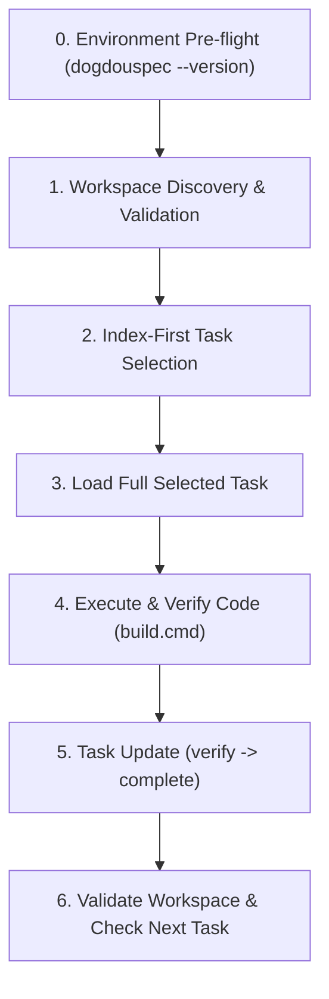

# DogdouSpec Workflow Guide

DogdouSpec is an iteration-first specification and task management system designed to keep multi-step, complex engineering tasks structured, token-efficient, and resilient across AI coding sessions. Authoritative state is stored in XML documents under `.dogdouspec/` and validated against XSD v1 schemas.

---

## 1. Design Philosophy & When to Use DogdouSpec

### The Core Problem DogdouSpec Solves
Traditional monolithic markdown files (e.g., `TODO.md`, `PLAN.md`, `TASKS.md`) impose a severe cognitive and token burden on AI coding agents. As sessions grow, repeatedly loading and parsing large markdown task graphs causes **context drift**, **lost constraints**, **hallucinated checkboxes**, and **massive token waste**.

DogdouSpec replaces unstructured markdown tracking with **schema-validated XML artifacts, deterministic concurrency locks, and two-phase XPath queries (`ds:filter`)**, loading only the active task's minimal context (saving ~90% tokens per step) and preventing context corruption across multi-session or multi-agent handoffs.

### Two Explicit Operating Modes (Avoid False Friction)

| Mode | Applicable Scenarios | Workflow & Overhead |
|---|---|---|
| ⚡ **Mode A: Direct Execution** *(Default for Minor Work)* | Standalone bug fixes, single-file refactorings, script tweaks, typo corrections, or bounded changes completed in a single commit. | **Zero DogdouSpec Overhead**: Do **NOT** create, query, or mutate `.dogdouspec/` iterations or tasks. Make code changes directly, run tests, and record full rationale in the Git Commit Message (Title + numbered details). |
| 🛡️ **Mode B: Governed Iterations** *(Complex & Multi-Step)* | Multi-step feature roadmaps, architectural overhauls, formal spec/acceptance gating, cross-session handoffs, or multi-agent collaboration. | **Full DogdouSpec Governance**: Follow the two-phase query pattern, task state transitions (`pending` -> `in-progress` -> `verification` -> `done`), and owner confirmation gates. |

> [!IMPORTANT]
> **Anti-Pattern Guard**: Never create or mutate DogdouSpec iterations for trivial single-commit tasks. Standard Git commit messages already explain bounded changes with zero friction. Use DogdouSpec when durable iteration governance and token-efficient state tracking are truly required.

---

## 2. Core Invariants (When Using DogdouSpec)

1. **Global CLI Execution & Pre-flight**: Use the global `dogdouspec <command>`. Before running commands, verify `dogdouspec --version`. If `dogdouspec` is missing, fail closed and prompt the user to install via `winget install Vixasol.DogdouSpec`. No repository-local wrapper scripts (`dogdouspec.cmd`) or background daemons are required.
2. **Never Edit Managed XML Directly**: Never edit, write, or copy `.dogdouspec/*.xml` using text editors or scripts. All mutations must pass through the public CLI (`task update`, `task review`, `task add`, `task revise`, `task split`, `requirement propose`, `change propose`, `change apply`, `append`, `transaction apply`, `iteration confirm`).
3. **Two-Phase Query Pattern**: Query compact indexes first (`ds:filter`), then load full task details only for the active task. Never load whole task graphs into context.
4. **Exact Revisions & Post-Mutation Re-Query**: Always pass exact expected revisions to mutating commands. After each mutation, validate the workspace with `dogdouspec validate` and re-query target documents.
5. **Respect Authority Boundaries**: Technical task automation never auto-completes product requirements, design decisions, acceptance criteria, or iterations. Stop and prompt the owner when product decisions are needed.
6. **Terminal Task Immutability**: Tasks in `done`, `transferred`, `superseded`, or `cancelled` statuses are immutable; low-level edits and execution transitions fail with `TASK_IMMUTABLE`. Only append-only informational records may be added.
7. **Replanning Execution Freeze**: When an iteration is in `status="replanning"`, task execution transitions (`start`, `resume`, `verify`, `complete`) fail closed with `ITERATION_REPLANNING_EXECUTION_FROZEN`. Technical planning helpers (`task add`, `task split`, `change apply`) and terminal dispositions remain enabled.

---

## 3. Standard Agent Workflow Loop (When in Mode B)



### 0. Environment Pre-flight (Discovery & Fail-Closed Guard)

Before executing DogdouSpec commands, verify that `dogdouspec` is available in PATH:

```powershell
dogdouspec --version
```

> [!IMPORTANT]
> **Fail-Closed Guard**: If `dogdouspec` is not found or fails to execute:
> 1. **STOP immediately**. Do NOT attempt to read or edit `.dogdouspec/*.xml` directly.
> 2. Output the following user instruction:
>    > ⚠️ **DogdouSpec CLI is not installed on this system.**
>    > Please install it via WinGet:
>    > ```powershell
>    > winget install Vixasol.DogdouSpec
>    > ```

### 1. Workspace Discovery & Validation

Verify workspace health and list active iterations:

```powershell
dogdouspec workspace discover --format xml
dogdouspec validate --format xml
dogdouspec iteration list --format xml
```

### 2. Index-First Task Selection (Two-Phase Query)

Use two explicit compact queries to derive the next actionable task:

1. **Resume In-Progress or Verification Task** (Highest Priority):
   ```powershell
   dogdouspec query --document "<ITERATION_ID>/tasks.xml" --xpath "ds:filter(/tasks/task[@status='in-progress' or @status='verification'][1], '@id', '@status', '@agent', 'index')" --format xml
   ```

2. **Next Ready Pending Task** (If no task is in-progress or in verification):
   ```powershell
   dogdouspec task next --iteration "<ITERATION_ID>" --format xml
   ```

   This public read-only helper is mandatory whenever the active-task query is
   empty. A pending-task XPath is document-local and cannot prove readiness for
   `depends-on` references in another iteration or document.

### 3. Load Full Selected Task

Load the complete task document by ID:

```powershell
dogdouspec query --document "<ITERATION_ID>/tasks.xml" --xpath "/tasks/task[@id='<TASK_ID>']" --format xml
```

Identify objectives, scope includes/excludes, origin requirement, acceptance criteria, constraints, and previous records before modifying code.

### 4. Technical Execution & State Transitions

#### ⚡ Fast-Path: High-Level Porcelain Commands (Zero-XML in Terminal — Recommended)

1. **Start Task** (transitions `pending` -> `in-progress`):
   ```powershell
   dogdouspec task start --task "<TASK_ID>" [--iteration "<ITERATION_ID>"] [--summary "..."] --format xml
   ```
2. **Implement & Build**:
   - Make necessary code and test changes.
   - Run `.\build.cmd` (or project build command) to compile and execute all tests.
3. **Verify Task** (transitions `in-progress` -> `verification`):
   ```powershell
   dogdouspec task verify --task "<TASK_ID>" [--iteration "<ITERATION_ID>"] [--covers "<CRITERION_ID>"] [--summary "..."] --format xml
   ```
4. **Review Gate, When Required**: If the selected Task contains `<review required="true">`, submit `task review` while it is in `verification`.
   ```powershell
   Get-Content task_review.xml -Raw | dogdouspec task review --iteration "<ITERATION_ID>" --task "<TASK_ID>" --expected-revision <REV> --stdin --format xml
   ```
5. **Complete Task** (transitions `verification` -> `done` or atomic finish):
   ```powershell
   # Standard finish:
   dogdouspec task finish --task "<TASK_ID>" [--iteration "<ITERATION_ID>"] [--summary "..."] --format xml
   ```

#### 🛡️ Low-Level Plumbing Fallback (Raw XML Payload)
If detailed manual record payloads are required:
- `dogdouspec task update --iteration "<ITERATION_ID>" --task "<TASK_ID>" --expected-revision <REV> --stdin/--file <PATH> --format xml`

### 5. Task & Requirement Change Decision Tree

When requirements, scope, or architecture need adjustment during an iteration:

- **Elaborating an Active or Pending Task**: Use `dogdouspec task revise` to add constraints, acceptance criteria, or dependencies.
- **Adding Bounded Work for Immediate Execution**: Use `dogdouspec task quick --title ... --scope ... --done-when ... --why ... [--start]`.
- **Adding a New Planned Technical Task**: Use `dogdouspec task add` to add a pending task referencing an existing approved requirement.
- **Deferred or Material Work**: Put work not ready to execute in backlog (`dogdouspec backlog add`). If it changes product behavior, architecture, requirements, or owner acceptance boundaries, use `change propose`.
- **Splitting a Complex Task**: Use `dogdouspec task split` to mark the parent task `superseded`, `transferred`, or `cancelled` and add 2+ focused pending subtasks atomically.
- **Proposing a New Requirement**: Use `dogdouspec requirement propose` to add a requirement with `status="proposed"` (owner confirmation via `iteration confirm` is required).

### 6. Post-Mutation Re-query & Validation

Always re-validate the workspace and re-query after writing:

```powershell
dogdouspec validate --format xml
dogdouspec query --document "<ITERATION_ID>/tasks.xml" --xpath "/tasks/task[@id='<TASK_ID>']/@status" --format xml
```

---

## 4. Supporting References

- **[XPath Query & Projection Reference](references/xpath.md)**: Query optimization and `ds:filter` projections.
- **[Mutation Operations Reference](references/mutations.md)**: Detailed semantics for all CLI mutation operations.
- **[Authority & Lifecycle Reference](references/authority.md)**: Iteration readiness, owner gates, and replanning.