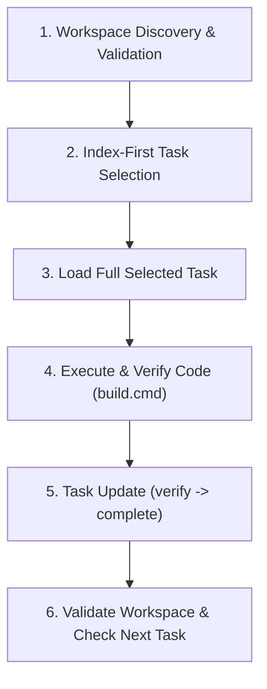

# DogdouSpec Workflow Guide

DogdouSpec is a repository-local, iteration-first specification and task management system designed to keep multi-step, complex engineering tasks structured, token-efficient, and resilient across AI coding sessions. Authoritative state is stored in XML documents under `.dogdouspec/` and validated against XSD v1 schemas.

## When to Use DogdouSpec

- **Recommended**: Complex features, multi-step iterations, formal spec/requirement governance, architectural changes, or when cross-session/multi-agent task handoff is needed.
- **Bypass / Do Not Use**: Routine bug fixes, minor documentation updates, single-commit refactorings, or lightweight ad-hoc tasks. For those, make code changes directly and rely on standard Git commit messages without creating or mutating DogdouSpec iterations.

## Core Invariants (When Using DogdouSpec)

1. **Repository-Local Execution**: Use `.\dogdouspec.cmd` (Windows) or `dotnet run --project src/DogdouSpec.Cli/DogdouSpec.Cli.csproj --` (cross-platform). No global tools, background daemons, or MCP servers are required.
2. **Never Edit Managed XML Directly**: Never edit, write, or copy `.dogdouspec/*.xml` using text editors or scripts. All mutations must pass through the public CLI (`task update`, `task review`, `task add`, `task revise`, `task split`, `requirement propose`, `change propose`, `change apply`, `append`, `transaction apply`, `iteration confirm`).
3. **Two-Phase Query Pattern**: Query compact indexes first (`ds:filter`), then load full task details only for the active task. Never load whole task graphs into context.
4. **Exact Revisions & Post-Mutation Re-Query**: Always pass exact expected revisions to mutating commands. After each mutation, validate the workspace with `dogdouspec validate` and re-query target documents.
5. **Respect Authority Boundaries**: Technical task automation never auto-completes product requirements, design decisions, acceptance criteria, or iterations. Stop and prompt the owner when product decisions are needed.
6. **Terminal Task Immutability**: Tasks in `done`, `transferred`, `superseded`, or `cancelled` statuses are immutable; low-level edits and execution transitions fail with `TASK_IMMUTABLE`. Only append-only informational records may be added.
7. **Replanning Execution Freeze**: When an iteration is in `status="replanning"`, task execution transitions (`start`, `resume`, `verify`, `complete`) fail closed with `ITERATION_REPLANNING_EXECUTION_FROZEN`. Technical planning helpers (`task add`, `task split`, `change apply`) and terminal dispositions remain enabled.

---

## Standard Agent Workflow Loop



### 1. Workspace Discovery & Validation

Verify workspace health and list active iterations:

```powershell
.\dogdouspec.cmd workspace discover --format xml
.\dogdouspec.cmd validate --format xml
.\dogdouspec.cmd iteration list --format xml
```

### 2. Index-First Task Selection (Two-Phase Query)

Use two explicit compact queries to derive the next actionable task:

1. **Resume In-Progress or Verification Task** (Highest Priority):
   ```powershell
   .\dogdouspec.cmd query --document "<ITERATION_ID>/tasks.xml" --xpath "ds:filter(/tasks/task[@status='in-progress' or @status='verification'][1], '@id', '@status', '@agent', 'index')" --format xml
   ```

2. **Next Ready Pending Task** (If no task is in-progress or in verification):
   ```powershell
   .\dogdouspec.cmd task next --iteration "<ITERATION_ID>" --format xml
   ```

   This public read-only helper is mandatory whenever the active-task query is
   empty. A pending-task XPath is document-local and cannot prove readiness for
   `depends-on` references in another iteration or document.

*Note: Blocked tasks (`@status='blocked'`) are reported separately to resolve blockers or escalate.*

### 3. Load Full Selected Task

Load the complete task document by ID:

```powershell
.\dogdouspec.cmd query --document "<ITERATION_ID>/tasks.xml" --xpath "/tasks/task[@id='<TASK_ID>']" --format xml
```

Identify objectives, scope includes/excludes, origin requirement, acceptance criteria, constraints, and previous records before modifying code.

### 4. Technical Execution & State Transitions

1. **Start Task** (transitions `pending` -> `in-progress`):
   ```powershell
   Get-Content update_start.xml -Raw | .\dogdouspec.cmd task update --iteration "<ITERATION_ID>" --task "<TASK_ID>" --expected-revision <REV> --stdin --format xml
   ```
2. **Implement & Build**:
   - Make necessary code and test changes.
   - Run `.\build.cmd` to compile and execute all tests.
3. **Verify Task** (transitions `in-progress` -> `verification`):
   ```powershell
   Get-Content update_verify.xml -Raw | .\dogdouspec.cmd task update --iteration "<ITERATION_ID>" --task "<TASK_ID>" --expected-revision <REV> --stdin --format xml
   ```
4. **Review Gate, When Required**: If the selected Task contains `<review required="true">`, submit `task review` while it is in `verification`. Approval actor must differ from Task `@agent`; this is provenance separation, not authenticated identity. `changes-requested` creates an active finding and returns the Task to `in-progress`, so correct it, resolve the finding, verify again, and obtain fresh approval.
   ```powershell
   Get-Content task_review.xml -Raw | .\dogdouspec.cmd task review --iteration "<ITERATION_ID>" --task "<TASK_ID>" --expected-revision <REV> --stdin --format xml
   ```
5. **Complete Task** (transitions `verification` -> `done`):
   ```powershell
   Get-Content update_complete.xml -Raw | .\dogdouspec.cmd task update --iteration "<ITERATION_ID>" --task "<TASK_ID>" --expected-revision <REV> --stdin --format xml
   ```

### 5. Task & Requirement Change Decision Tree

When requirements, scope, or architecture need adjustment during an iteration:

- **Elaborating an Active or Pending Task**: Use `dogdouspec task revise` to add constraints, acceptance criteria, or dependencies, and append discussion records without modifying decided product scope. Once a task has started, retain its rationale and only submit an additive scope expansion; record changed reasoning as discussion.
- **Adding Bounded Work for Immediate Execution**: Use `dogdouspec task quick --title ... --scope ... --done-when ... --why ... [--start]`. It remains a normal Task; omit `--origin` only for operational maintenance. Deferred work belongs in backlog.
- **Adding a New Planned Technical Task**: Use `dogdouspec task add` to add a pending task referencing an existing approved requirement.
- **Deferred or Material Work**: Put work not ready to execute in backlog. If it changes product behavior, architecture, requirements, or owner acceptance boundaries, use `change propose`, not `task quick` or `task revise`.
- **Backlog Lifecycle**: Use `dogdouspec backlog add` for a credible non-blocking obligation, `backlog list` to inspect it, and `backlog schedule|complete|cancel` for its governed disposition. Supply the exact `backlog.xml` revision and stable replay IDs. A `--resolving-task` link is backlog evidence only and never changes that Task's origin.
- **Splitting a Complex Task**: Use `dogdouspec task split` to mark the parent task `superseded`, `transferred`, or `cancelled` and add 2+ focused pending subtasks atomically.
- **Proposing a New Requirement**: Use `dogdouspec requirement propose` to add a requirement with `status="proposed"`. (Technical agents cannot self-approve; owner confirmation via `iteration confirm` is required).
- **Handling Mid-Flight Surprises / Material Scope Gaps**:
  1. Use `dogdouspec change propose` to attach an active finding record to the task, freeze target tasks to `blocked`, and add proposed requirements to `spec.xml`.
  2. Ask the human product owner to confirm replanning (`dogdouspec iteration confirm --stdin` with `action="replan"`).
  3. During `status="replanning"`, use `dogdouspec change apply` to resolve active findings, apply task dispositions (`superseded`/`transferred`/`cancelled`), and add successor tasks.
  4. Ask the product owner to confirm continuation (`dogdouspec iteration confirm --stdin` with `action="continue"`).

### Governance boundaries

An excluded path or concern only limits the current Task's scope. It is **not**
evidence that work was deferred, accepted as risk, or no longer required. Do
not create governance records merely because a Task has an exclusion.

| Surface | Required when | Optional / do not use when |
|---|---|---|
| Backlog | A credible non-blocking obligation remains after the current Task: record its source, impact, why it is not current acceptance, and a review or scheduling condition. Deferring currently required work or accepting product risk remains an owner gate. | A scope exclusion is only a boundary, the concern has been resolved, or no future obligation is known. |
| Knowledge | A stable, reusable fact is likely to affect future Tasks or Iterations and its source can be stated. | One-off command output, raw investigation notes, a transient failed attempt, or a fact already captured by the Task record. |
| `design_snapshot` | A handoff or verification cannot be safely resumed without concise Task-local technical context: the chosen approach, its constraint, and the next consequence. | Routine status, implementation boilerplate, or a formal product/design choice already represented elsewhere. Omit it rather than restating the Task. |
| Formal design decision | A choice changes product behavior, an external/compatibility or security boundary, or materially constrains other Tasks and therefore needs owner disposition. Propose it and stop for the owner; a snapshot never substitutes for this decision. | Reversible implementation mechanics wholly inside an accepted boundary. Record only the material rationale needed by the next executor. |

Verification records and handoffs use the same rule: include a
`design_snapshot` only when that material context is needed to verify or resume
the Task. A concise check result and next step are normally sufficient.

### 6. Post-Mutation Re-query & Validation

Always re-validate the workspace and re-query after writing:

```powershell
.\dogdouspec.cmd validate --format xml
.\dogdouspec.cmd query --document "<ITERATION_ID>/tasks.xml" --xpath "/tasks/task[@id='<TASK_ID>']/@status" --format xml
```

---

## Supporting References

Read these dedicated reference guides for specialized operations:

- **[XPath Query & Projection Reference](references/xpath.md)**: Read when writing XPath queries, using variables, or applying `ds:filter` / `ds:filter-out` member projections.
- **[Mutation Operations Reference](references/mutations.md)**: Read when choosing between `task update`, `task add`, `task revise`, `task split`, `requirement propose`, `change propose`, `change apply`, `append`, and `transaction apply`.
- **[Authority & Lifecycle Reference](references/authority.md)**: Read when checking iteration readiness, processing owner confirmations, or handling surprises and replanning.
