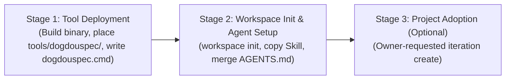

# Deploying DogdouSpec to Another Repository (Air-Gapped & Vendored Source Deployment)

> [!IMPORTANT]
> **When to Use This Guide**: This document provides the authoritative air-gapped / repository-local vendoring and source build procedure for environments where global package managers, global binaries, or PATH aliases are not permitted (e.g. strict air-gapped CI/CD runners, isolated sandboxes, or hermetic monorepos).
>
> **Standard Adoption (Recommended for Most Projects)**: For standard development environments, DogdouSpec should be installed globally via **WinGet** (`winget install Vixasol.DogdouSpec`) and initialized using `dogdouspec workspace init` and `dogdouspec skill sync` with zero repository-local binaries or wrapper scripts.
>
> **Agent Guidelines (`AGENTS.md`)**: In both deployment modes, `AGENTS.md` should be adapted and tailored contextually by the coding agent or project maintainer to match the target project's build and verification tooling, rather than blindly copied.

---

## 1. Core Principles & Lifecycle Stages

Deploying DogdouSpec into an external repository involves three distinct, sequential stages. **Do not conflate these stages.**



1. **Stage 1: Tool Deployment (Executable & Wrapper)**
   - Builds a self-contained `win-x64` single-file executable from an approved, pinned source commit into an isolated external temporary staging folder.
   - Installs the executable into `<TARGET_REPO>/tools/dogdouspec/dogdouspec.exe` and places the root wrapper `<TARGET_REPO>/dogdouspec.cmd`.
   - Verifies executable integrity (`--version` and SHA256 hash).
   - Preserves all existing target repository files.

2. **Stage 2: Workspace Initialization & Agent Integration**
   - Runs `dogdouspec workspace init` to generate `.dogdouspec/` with authoritative XSD schemas, `_skill/`, `backlog.xml`, and `knowledge.xml`.
   - Copies the DogdouSpec agent skill (`.agents/skills/dogdouspec/`) to the target repository.
   - Non-destructively merges a minimal DogdouSpec workflow block into the target repository's `AGENTS.md` (never overwriting existing project rules; keeps pre-merge backup in the external staging directory).
   - Validates workspace integrity using `dogdouspec validate`.
   - Establishes that semantic agent results live in `tasks.xml` Task records, not a durable report folder.
   - In a Git-backed target, reviews authoritative `.dogdouspec/` files for an explicit VCS checkpoint; only `_tmp/` is runtime-only.

3. **Stage 3: Project Adoption (Optional First Iteration)**
   - **Product Authority Boundary**: Technical coding agents must **never** auto-create iterations, invent requirements, or define tasks without explicit instruction from the human project owner.
   - An iteration is created **only** when the human owner explicitly supplies an iteration identifier (`YYYYMMDD-name`) and kind (`feature` or `research`).

> [!CAUTION]
> **Never Copy Managed State Wholesale**: Never copy this source repository's `.dogdouspec/` directory or root `AGENTS.md` wholesale into the target repository. DogdouSpec manages per-project state; copying existing iterations or repository-specific agent rules will corrupt target workspace authority.

> [!NOTE]
> **Packaging Architecture**: The deployment builds a trimmed, self-contained native executable (`win-x64`) using Native AOT compilation (`PublishAot`) with IL trimming fallback. It does not rely on external runtime dependencies or NuGet/global package feeds at target runtime. The target machine requires only Windows x64; the .NET SDK (`10.0.*`-compatible) is required only on the machine building the binary from source.

> [!IMPORTANT]
> **Verified Reference Baseline**: The verified reference commit baseline tested with DogdouSpec v1 is `50c40cc01e959c057b22846d29a5e9d3d2e15dfa` (commit `50c40cc`). The installer or project owner must explicitly supply their approved 40-hex commit SHA for their concrete deployment.

---

## 2. Target Repository Layout

Following this deployment procedure, the target repository will have the following exact layout:

```text
<TARGET_REPO>/
├── dogdouspec.cmd                     # Root wrapper script for repo-local execution
├── tools/
│   └── dogdouspec/
│       └── dogdouspec.exe             # Self-contained win-x64 single-file executable (~9.5 MB)
├── .dogdouspec/                       # Managed XML workspace directory (created by workspace init)
├── .agents/
│   └── skills/
│       └── dogdouspec/                # DogdouSpec Agent Skill instructions and references (default path)
│           ├── SKILL.md
│           └── references/
│               ├── authority.md
│               ├── mutations.md
│               └── xpath.md
└── AGENTS.md                          # Repository agent guidelines (merged non-destructively)
```

---

## 3. Preflight & Safety Checks

Before modifying any files, execute the following preflight checks in PowerShell. All checks fail closed upon any safety discrepancy.

### 3.1. Define Explicit Variables & Resolve Canonical Paths

Do not rely on `$HOME` or implicit user profile paths. Provide explicit paths and an owner-approved 40-character hexadecimal commit SHA:

```powershell
# snippet: preflight-setup
$ErrorActionPreference = "Stop"

# Caller-provided paths and approved commit SHA (must be supplied by installer)
$SOURCE_REPO_INPUT = "L:\dogdou\dogdouspec"
$TARGET_REPO_INPUT = "C:\path\to\target_repo"

# Explicit 40-character hexadecimal commit SHA approved by the project owner
# (Example reference baseline: 50c40cc01e959c057b22846d29a5e9d3d2e15dfa)
$PINNED_COMMIT = "<approved-full-40-hex-commit>"

# Validate PINNED_COMMIT is exactly 40 hexadecimal characters
if ($PINNED_COMMIT -notmatch '^[0-9a-fA-F]{40}$') {
    throw "[ERROR] PINNED_COMMIT must be an explicit, 40-character hexadecimal commit SHA. Received: '$PINNED_COMMIT'."
}

# Resolve canonical absolute paths
$SOURCE_REPO = [System.IO.Path]::GetFullPath($SOURCE_REPO_INPUT)
$TARGET_REPO = [System.IO.Path]::GetFullPath($TARGET_REPO_INPUT)

# Generate a unique GUID staging directory path outside both repos
$STAGING_DIR = [System.IO.Path]::GetFullPath((Join-Path $env:TEMP "dogdouspec-stage-$([System.Guid]::NewGuid().ToString('N'))"))
$EXPECTED_STAGING_PATH = $STAGING_DIR

# Path containment helpers
function Test-IsSubpath([string]$child, [string]$parent) {
    $normChild = [System.IO.Path]::GetFullPath($child).TrimEnd('\', '/') + '\'
    $normParent = [System.IO.Path]::GetFullPath($parent).TrimEnd('\', '/') + '\'
    return $normChild.StartsWith($normParent, [System.StringComparison]::OrdinalIgnoreCase)
}

function Assert-InsideTarget([string]$path, [string]$targetRoot) {
    $normChild = [System.IO.Path]::GetFullPath($path).TrimEnd('\', '/') + '\'
    $normParent = [System.IO.Path]::GetFullPath($targetRoot).TrimEnd('\', '/') + '\'
    if (-not $normChild.StartsWith($normParent, [System.StringComparison]::OrdinalIgnoreCase)) {
        throw "[SECURITY ERROR] Path '$path' is outside target repository '$targetRoot'."
    }
}

function Remove-StagingDirectory([string]$staging, [string]$source, [string]$target, [string]$expectedGuidPath) {
    $normStaging = [System.IO.Path]::GetFullPath($staging)
    $normExpected = [System.IO.Path]::GetFullPath($expectedGuidPath)
    if ($normStaging -ne $normExpected) {
        throw "[SECURITY ERROR] Staging path does not match expected GUID path created by this run."
    }
    if ((Test-IsSubpath $normStaging $source) -or (Test-IsSubpath $normStaging $target)) {
        throw "[SECURITY ERROR] Staging path is unexpectedly inside a repository."
    }
    if (Test-Path "$normStaging") {
        Remove-Item -Recurse -Force "$normStaging"
        Write-Host "[OK] Cleaned staging directory: $normStaging"
    }
}

function Test-SkillDirectoryDivergence([string]$dirPath, [string]$sourceDir) {
    if (-not (Test-Path "$dirPath")) {
        return @{ Exists = $false; IsDivergent = $false; IsExactMatch = $false; Differences = @() }
    }
    $srcFiles = Get-ChildItem -Recurse -File "$sourceDir"
    $tgtFiles = Get-ChildItem -Recurse -File "$dirPath"

    $srcMap = @{}
    foreach ($f in $srcFiles) {
        $rel = $f.FullName.Substring($sourceDir.Length).TrimStart('\', '/') -replace '\\', '/'
        $srcMap[$rel] = (Get-FileHash $f.FullName -Algorithm SHA256).Hash
    }

    $tgtMap = @{}
    foreach ($f in $tgtFiles) {
        $rel = $f.FullName.Substring($dirPath.Length).TrimStart('\', '/') -replace '\\', '/'
        $tgtMap[$rel] = (Get-FileHash $f.FullName -Algorithm SHA256).Hash
    }

    $diffs = @()
    foreach ($rel in $srcMap.Keys) {
        if (-not $tgtMap.ContainsKey($rel)) {
            $diffs += "Missing standard file: $rel"
        } elseif ($srcMap[$rel] -ne $tgtMap[$rel]) {
            $diffs += "Modified standard file: $rel"
        }
    }
    foreach ($rel in $tgtMap.Keys) {
        if (-not $srcMap.ContainsKey($rel)) {
            $diffs += "Extra custom file: $rel"
        }
    }

    $isExact = ($diffs.Count -eq 0)
    return @{
        Exists = $true
        IsDivergent = (-not $isExact)
        IsExactMatch = $isExact
        Differences = $diffs
    }
}

# Verify staging directory is strictly outside both source and target repos
if ((Test-IsSubpath $STAGING_DIR $SOURCE_REPO) -or (Test-IsSubpath $STAGING_DIR $TARGET_REPO)) {
    throw "[ERROR] Staging directory '$STAGING_DIR' must be strictly outside both source ('$SOURCE_REPO') and target ('$TARGET_REPO')."
}

# Verify staging directory does not already exist
if (Test-Path "$STAGING_DIR") {
    throw "[ERROR] Staging path '$STAGING_DIR' unexpectedly already exists. Aborting to avoid modifying existing files."
}
```

### 3.2. Check Prerequisites & Source/Target Repositories

```powershell
# snippet: preflight-checks
# 1. Verify .NET SDK in source repo context (honors global.json)
if (-not (Test-Path "$SOURCE_REPO\.git")) {
    throw "[ERROR] Source repository not found or not a git repository at '$SOURCE_REPO'."
}

Push-Location "$SOURCE_REPO"
try {
    $dotnetVersion = (dotnet --version).Trim()
    if ($LASTEXITCODE -ne 0 -or [string]::IsNullOrWhiteSpace($dotnetVersion)) {
        throw "[ERROR] .NET SDK failed to resolve for source repository at '$SOURCE_REPO'."
    }
    Write-Host "[OK] Resolved .NET SDK in source repo context: $dotnetVersion"
} finally {
    Pop-Location
}

# 2. Verify Source Repository dirty-tree safety and commit pin
# Fail closed on dirty source tree because dotnet publish compiles the working tree
$sourceDirty = (git -C "$SOURCE_REPO" status --porcelain)
if ($sourceDirty) {
    throw "[ERROR] Source repository has uncommitted changes. 'dotnet publish' compiles the working tree. Source must be clean before deploying."
}

# Verify source HEAD matches the approved 40-hex commit
$sourceHead = (git -C "$SOURCE_REPO" rev-parse HEAD).Trim()
if ($sourceHead -ne $PINNED_COMMIT) {
    throw "[ERROR] Source HEAD ($sourceHead) does not match approved commit pin ($PINNED_COMMIT). Installation aborted."
}
Write-Host "[OK] Source HEAD matches approved pin: $sourceHead"

# 3. Verify Target Repository is a valid Git repo and clean before installation
if (-not (Test-Path "$TARGET_REPO\.git")) {
    throw "[ERROR] Target repository not found or not a git repository at '$TARGET_REPO'."
}

$targetDirty = (git -C "$TARGET_REPO" status --porcelain)
if ($targetDirty) {
    throw "[ERROR] Target repository contains uncommitted changes. Initial installation requires a clean working tree before starting."
}

# 4. Fail closed if any DogdouSpec components already exist in target
$existingToolDir = Test-Path "$TARGET_REPO\tools\dogdouspec"
$existingWrapper = Test-Path "$TARGET_REPO\dogdouspec.cmd"
$existingWorkspace = Test-Path "$TARGET_REPO\.dogdouspec"
$existingSkillDir = Test-Path "$TARGET_REPO\.agents\skills\dogdouspec"
$existingLegacySkillDir = Test-Path "$TARGET_REPO\skills\dogdouspec"

if ($existingToolDir -or $existingWrapper -or $existingWorkspace -or $existingSkillDir -or $existingLegacySkillDir) {
    throw "[ERROR] Existing DogdouSpec components detected in target repository (tools/dogdouspec: $existingToolDir, wrapper: $existingWrapper, .dogdouspec: $existingWorkspace, .agents/skills/dogdouspec: $existingSkillDir, legacy skills/dogdouspec: $existingLegacySkillDir). Initial installation stopped to avoid clobbering. Use Section 8 (Upgrade Procedure) to upgrade an existing installation."
}
Write-Host "[OK] Preflight checks passed. Target repository is clean and ready for initial installation."
```

---

## 4. Stage 1: Tool Deployment (Build & Install Executable)

### 4.1. Build Self-Contained Executable into External Staging

Create the unique staging directory and compile the self-contained `win-x64` single-file binary:

```powershell
# snippet: tool-publish
# Create staging directory (verified non-existent during preflight)
New-Item -ItemType Directory -Path "$STAGING_DIR" | Out-Null

if ($env:DOGDOUSPEC_PREBUILT_DIR -and (Test-Path "$env:DOGDOUSPEC_PREBUILT_DIR")) {
    Copy-Item -Path "$env:DOGDOUSPEC_PREBUILT_DIR\*" -Destination "$STAGING_DIR" -Force
} elseif ($env:DOGDOUSPEC_PREBUILT_EXE -and (Test-Path "$env:DOGDOUSPEC_PREBUILT_EXE")) {
    Copy-Item -Path "$env:DOGDOUSPEC_PREBUILT_EXE" -Destination (Join-Path "$STAGING_DIR" "dogdouspec.exe")
} else {
    dotnet publish "$SOURCE_REPO\src\DogdouSpec.Cli\DogdouSpec.Cli.csproj" `
        -c Release `
        -r win-x64 `
        --self-contained true `
        -p:PublishSingleFile=true `
        -o "$STAGING_DIR"

    if ($LASTEXITCODE -ne 0) {
        throw "[ERROR] dotnet publish failed with exit code $LASTEXITCODE"
    }
}

$stagedExe = Join-Path "$STAGING_DIR" "dogdouspec.exe"
if (-not (Test-Path "$stagedExe")) {
    throw "[ERROR] Staged executable not found at '$stagedExe'"
}
```

### 4.2. Verify Staged Binary Version and Hash

```powershell
# snippet: tool-verify
# Verify CLI version banner reflects the pinned commit
$versionOutput = & "$stagedExe" --version
Write-Host "[OK] Staged CLI Version: $versionOutput"
if ($versionOutput -notlike "*$PINNED_COMMIT*") {
    throw "[ERROR] Staged binary version ($versionOutput) does not contain commit pin ($PINNED_COMMIT)."
}

# Compute SHA256 checksum for verification
$stagedHash = (Get-FileHash "$stagedExe" -Algorithm SHA256).Hash
Write-Host "[OK] Staged Executable SHA256: $stagedHash"
```

### 4.3. Install Executable to Target Repository

Validate target path is absent, then copy without overwriting existing files:

```powershell
# snippet: tool-install
$targetToolDir = Join-Path "$TARGET_REPO" "tools\dogdouspec"
Assert-InsideTarget $targetToolDir $TARGET_REPO
if (-not (Test-Path "$targetToolDir")) {
    New-Item -ItemType Directory -Path "$targetToolDir" -Force | Out-Null
}

$targetExe = Join-Path "$targetToolDir" "dogdouspec.exe"
Assert-InsideTarget $targetExe $TARGET_REPO
if (Test-Path "$targetExe") {
    throw "[ERROR] Target executable already exists at '$targetExe'."
}

if ($env:DOGDOUSPEC_PREBUILT_DIR) {
    Copy-Item -Path (Join-Path "$STAGING_DIR" "*") -Destination "$targetToolDir\" -Force
} else {
    Copy-Item -Path "$stagedExe" -Destination "$targetExe"
}

# Verify installed binary hash matches staged binary hash
$installedHash = (Get-FileHash "$targetExe" -Algorithm SHA256).Hash
if ($installedHash -ne $stagedHash) {
    throw "[ERROR] Installed executable hash mismatch ($installedHash vs $stagedHash)"
}
Write-Host "[OK] Executable installed and verified at '$targetExe'"
```

### 4.4. Create Root CLI Wrapper (`dogdouspec.cmd`)

Create `$TARGET_REPO\dogdouspec.cmd` (validating it does not already exist):

```powershell
# snippet: wrapper-create
$wrapperPath = Join-Path "$TARGET_REPO" "dogdouspec.cmd"
Assert-InsideTarget $wrapperPath $TARGET_REPO
if (Test-Path "$wrapperPath") {
    throw "[ERROR] Wrapper script already exists at '$wrapperPath'."
}

$wrapperContent = @'
@echo off
setlocal
if not exist "%~dp0tools\dogdouspec\dogdouspec.exe" (
    echo [ERROR] DogdouSpec executable not found at "%~dp0tools\dogdouspec\dogdouspec.exe" 1>&2
    exit /b 1
)
"%~dp0tools\dogdouspec\dogdouspec.exe" %*
exit /b %ERRORLEVEL%
'@

Set-Content -Path "$wrapperPath" -Value $wrapperContent -Encoding Ascii -NoNewline
Write-Host "[OK] Created wrapper at '$wrapperPath'"
```

### 4.5. Verify Wrapper Execution

```powershell
# snippet: wrapper-verify
Push-Location "$TARGET_REPO"
try {
    $wrapperVersion = .\dogdouspec.cmd --version
    Write-Host "[OK] Wrapper verified: $wrapperVersion"
} finally {
    Pop-Location
}
```

---

## 5. Stage 2: Workspace Initialization & Agent Integration

### 5.1. Initialize Workspace

Initialize the managed `.dogdouspec` workspace using the repo-local wrapper:

```powershell
# snippet: workspace-init
Push-Location "$TARGET_REPO"
try {
    .\dogdouspec.cmd workspace init --format xml
    if ($LASTEXITCODE -ne 0) {
        throw "[ERROR] 'workspace init' failed with exit code $LASTEXITCODE"
    }
    Write-Host "[OK] Initialized .dogdouspec workspace"

    # Verify workspace discovery and initial validation
    .\dogdouspec.cmd workspace discover --format xml
    if ($LASTEXITCODE -ne 0) { throw "[ERROR] Workspace discovery failed." }

    .\dogdouspec.cmd validate --format xml
    if ($LASTEXITCODE -ne 0) { throw "[ERROR] Workspace validation failed." }
    Write-Host "[OK] Initial workspace validated successfully."
} finally {
    Pop-Location
}
```

The initialized XML is locally durable authoritative state, not generated cache. In a Git-backed governed repository, version managed `.dogdouspec/` files and ignore only `.dogdouspec/_tmp/`. DogdouSpec does not stage or commit them. If the installer lacks Git-write authority, report the exact untracked files as locally durable but not transport-ready.

### 5.2. Install DogdouSpec Agent Skill

Copy the checked-in skill instructions and references from `$SOURCE_REPO\.agents\skills\dogdouspec` into `$TARGET_REPO\.agents\skills\dogdouspec\`:

```powershell
# snippet: skill-install
$sourceSkillDir = Join-Path "$SOURCE_REPO" ".agents\skills\dogdouspec"
$targetSkillDir = Join-Path "$TARGET_REPO" ".agents\skills\dogdouspec"
$targetSkillRef = Join-Path "$targetSkillDir" "references"

Assert-InsideTarget $targetSkillDir $TARGET_REPO
if (-not (Test-Path "$targetSkillDir")) {
    Assert-InsideTarget $targetSkillRef $TARGET_REPO
    New-Item -ItemType Directory -Path "$targetSkillRef" -Force | Out-Null

    Copy-Item -Path (Join-Path "$sourceSkillDir" "SKILL.md") -Destination (Join-Path "$targetSkillDir" "SKILL.md")
    Copy-Item -Path (Join-Path "$sourceSkillDir" "references\*") -Destination (Join-Path "$targetSkillDir" "references\")
    Write-Host "[OK] Installed DogdouSpec skill in '$targetSkillDir'"
} else {
    Write-Host "[OK] DogdouSpec skill already initialized in '$targetSkillDir'"
}

```

### 5.3. Agent Setup Guidance (`AGENTS.md`)

DogdouSpec does **not** automatically write or modify `AGENTS.md`. How `AGENTS.md` is configured is an **agent + project owner decision**.

After workspace initialization, retrieve the embedded setup guidance and act on it:

```powershell
# snippet: agents-guide
Push-Location "$TARGET_REPO"
try {
    # Display AGENTS.md configuration guidance and the upgrade workflow.
    # The agent and project owner decide what to add and how to tailor it to the project.
    .\dogdouspec.cmd skill guide
} finally {
    Pop-Location
}
```

The `skill guide` output (§0 of SKILL.md) explains:
- What sections to add to `AGENTS.md` and the minimum content required.
- How to tailor build/verification commands to the target project's tech stack.
- What files to commit to Git.

> [!NOTE]
> A structural baseline for `AGENTS.md` is available in the DogdouSpec source repository at [`templates/v1/AGENTS.md`](../templates/v1/AGENTS.md). Coding agents or project maintainers may use it as a starting point and adapt it to the target project.


### 5.4. Post-Integration Workspace Validation

Verify whole-workspace health from within the target directory:

```powershell
# snippet: workspace-validate
Push-Location "$TARGET_REPO"
try {
    .\dogdouspec.cmd validate --format xml
    if ($LASTEXITCODE -ne 0) { throw "[ERROR] Post-integration validation failed." }
    Write-Host "[OK] Workspace and schema validation passed."

    Write-Host "=== Authoritative DogdouSpec VCS Status ==="
    git status --short -- .dogdouspec
} finally {
    Pop-Location
}
```

---

## 6. Stage 3: Project Adoption (Optional First Iteration)

Iteration creation represents project management intent and requires human product owner instruction.

### 6.1. Authority Rule

- **Do NOT** auto-create iterations during tool deployment.
- **Do NOT** guess iteration identifiers or invent requirements.
- **ONLY** create an iteration when the human owner has provided:
  1. An explicit identifier conforming to `YYYYMMDD-name` (e.g., `20260823-initial-bootstrap`).
  2. The iteration kind: `feature` or `research`.

### 6.2. Iteration Creation Command

When explicitly instructed by the owner:

```powershell
# snippet: iteration-create
Push-Location "$TARGET_REPO"
try {
    $ITERATION_ID = "20260823-initial-bootstrap" # Owner-provided ID
    $ITERATION_KIND = "feature"                   # 'feature' or 'research'

    .\dogdouspec.cmd iteration create --id "$ITERATION_ID" --kind "$ITERATION_KIND" --format xml
    if ($LASTEXITCODE -ne 0) { throw "[ERROR] Iteration creation failed." }

    # Verify iteration discovery and workspace validity
    .\dogdouspec.cmd iteration list --format xml
    .\dogdouspec.cmd validate --format xml
} finally {
    Pop-Location
}
```


## 7. Completion Review, Backup Retention & What Must Be Committed

### 7.1. Final Status Review & Staging Retention

After all installation stages, agent integration, and validation succeed, review the modified target repository. Keep the external staging directory until the owner accepts the installation or the intended target changes are committed; it contains the only pre-merge `AGENTS.md` backup needed for a safe pre-commit rollback.

```powershell
# snippet: review-status
Push-Location "$TARGET_REPO"
try {
    Write-Host "=== Target Repository Git Status (Intentionally Modified) ==="
    git status --short
    Write-Host "[OK] The target repository was clean before installation and is now intentionally modified with new DogdouSpec files."
} finally {
    Pop-Location
}

Write-Host "[INFO] Retaining rollback staging at '$STAGING_DIR' until owner acceptance or commit."
```

Only after the owner accepts the installation or the intended target changes are committed may the installer clean the exact staging directory:

```powershell
# snippet: cleanup-staging
Remove-StagingDirectory -staging $STAGING_DIR -source $SOURCE_REPO -target $TARGET_REPO -expectedGuidPath $EXPECTED_STAGING_PATH
```

### 7.2. What Must Be Committed to Git

When tracking DogdouSpec in the target repository's version control:

| Path | Commit to Git? | Description |
| :--- | :---: | :--- |
| `dogdouspec.cmd` | **Yes** | Root CLI wrapper for developer and agent execution. |
| `tools/dogdouspec/dogdouspec.exe` | **Yes** | Repository-local self-contained binary (~9.5 MB), ensuring zero-dependency execution across machines and CI without requiring .NET SDK installation. |
| `.dogdouspec/` | **Yes** | Managed authoritative XML documents (`backlog.xml`, `knowledge.xml`, iterations) and `_schema/` XSD files. |
| `.agents/skills/dogdouspec/` | **Yes** | Agent skill definition and reference guides (default path). |
| `AGENTS.md` | **Yes** | Repository agent guidelines. |
| `.dogdouspec/_tmp/` | **No** | Runtime transaction staging and recovery markers (must be ignored in `.gitignore`). |

Semantic agent reports are not a separate committed component. Their material content belongs in `tasks.xml` records. Do not introduce a canonical `.agents/work-results/` tree; worker response files, prompts, request XML, and provider logs remain transient. Repository-approved storage may retain bulky raw evidence, but the owning Task records its summarized outcome and stable reference when required.

After installation, iteration activation, material lifecycle changes, review, handoff, external-blocker pauses, and release gates, validate the workspace and inspect `git status --short -- .dogdouspec`. Create the VCS checkpoint only with explicit repository-write authority. Without that authority, the installation or handoff is locally durable but not transport-ready until the listed managed files are checkpointed.

#### Recommended `.gitignore` Addition

```gitignore
# DogdouSpec runtime temporary staging files
/.dogdouspec/_tmp/
```

---

## 8. Upgrade Procedure

DogdouSpec v1 does **not** provide an automatic schema migration command. Upgrades are permitted as a binary and skill refresh only when the new CLI remains fully compatible with the workspace's existing XSD v1 schemas, as verified by workspace validation.

> [!CAUTION]
> **Do Not Modify `.dogdouspec/_schema/` Directly**: Never copy schema files directly into `.dogdouspec/_schema/`. All files inside `.dogdouspec/` are managed XML/schema state. If a future DogdouSpec version introduces incompatible schema revisions, stop and follow an explicit migration guide.

### 8.1. Upgrade Steps

Before running this block, define and validate `$SOURCE_REPO`, `$TARGET_REPO`, `$PINNED_COMMIT`, `Test-IsSubpath`, `Assert-InsideTarget`, `Test-SkillDirectoryDivergence`, and `Remove-StagingDirectory` using Section 3.1. Re-run the source SDK, clean-tree, and exact-HEAD checks from Section 3.2. For upgrade, do not run the initial-install collision rejection; instead, require the existing wrapper, executable, workspace, and at least one Skill installation path (`.agents/skills/dogdouspec` or legacy `skills/dogdouspec`) to be present.

```powershell
# snippet: upgrade-procedure
$ErrorActionPreference = "Stop"

# 1. Verify approved source and existing target installation
if ($PINNED_COMMIT -notmatch '^[0-9a-fA-F]{40}$') {
    throw "[ERROR] PINNED_COMMIT must be an explicit, 40-character hexadecimal commit SHA."
}
$sourceDirty = (git -C "$SOURCE_REPO" status --porcelain)
if ($sourceDirty) {
    throw "[ERROR] Source repository must be clean before upgrade publish."
}
$sourceHead = (git -C "$SOURCE_REPO" rev-parse HEAD).Trim()
if ($sourceHead -ne $PINNED_COMMIT) {
    throw "[ERROR] Source HEAD ($sourceHead) does not match approved commit pin ($PINNED_COMMIT)."
}

$requiredInstallPaths = @(
    "$TARGET_REPO\dogdouspec.cmd",
    "$TARGET_REPO\tools\dogdouspec\dogdouspec.exe",
    "$TARGET_REPO\.dogdouspec"
)
foreach ($requiredPath in $requiredInstallPaths) {
    if (-not (Test-Path "$requiredPath")) {
        throw "[ERROR] Existing installation is incomplete; required path is missing: '$requiredPath'."
    }
}

# Detect installed skill path(s) (default .agents/skills/dogdouspec or legacy skills/dogdouspec)
$targetDefaultSkill = Join-Path "$TARGET_REPO" ".agents\skills\dogdouspec"
$targetLegacySkill = Join-Path "$TARGET_REPO" "skills\dogdouspec"
$hasDefaultSkill = Test-Path "$targetDefaultSkill"
$hasLegacySkill = Test-Path "$targetLegacySkill"

if (-not $hasDefaultSkill -and -not $hasLegacySkill) {
    throw "[ERROR] Existing installation is incomplete; no skill found at '$targetDefaultSkill' or '$targetLegacySkill'."
}

# 2. Verify Target Working Tree Cleanliness
$targetDirty = (git -C "$TARGET_REPO" status --porcelain)
if ($targetDirty) { throw "[ERROR] Target repository contains uncommitted changes. Ensure working tree is clean before upgrading." }

# 3. Build and Stage Updated Executable into a fresh GUID staging directory
$STAGING_DIR = [System.IO.Path]::GetFullPath((Join-Path $env:TEMP "dogdouspec-stage-$([System.Guid]::NewGuid().ToString('N'))"))
$EXPECTED_STAGING_PATH = $STAGING_DIR
if ((Test-IsSubpath $STAGING_DIR $SOURCE_REPO) -or (Test-IsSubpath $STAGING_DIR $TARGET_REPO) -or (Test-Path "$STAGING_DIR")) {
    throw "[ERROR] Upgrade staging path is not a new external directory: '$STAGING_DIR'."
}
New-Item -ItemType Directory -Path "$STAGING_DIR" | Out-Null

if ($env:DOGDOUSPEC_PREBUILT_DIR -and (Test-Path "$env:DOGDOUSPEC_PREBUILT_DIR")) {
    Copy-Item -Path "$env:DOGDOUSPEC_PREBUILT_DIR\*" -Destination "$STAGING_DIR" -Force
} elseif ($env:DOGDOUSPEC_PREBUILT_EXE -and (Test-Path "$env:DOGDOUSPEC_PREBUILT_EXE")) {
    Copy-Item -Path "$env:DOGDOUSPEC_PREBUILT_EXE" -Destination (Join-Path "$STAGING_DIR" "dogdouspec.exe")
} else {
    dotnet publish "$SOURCE_REPO\src\DogdouSpec.Cli\DogdouSpec.Cli.csproj" `
        -c Release `
        -r win-x64 `
        --self-contained true `
        -p:PublishSingleFile=true `
        -o "$STAGING_DIR"

    if ($LASTEXITCODE -ne 0) {
        throw "[ERROR] dotnet publish failed with exit code $LASTEXITCODE"
    }
}

$stagedExe = Join-Path "$STAGING_DIR" "dogdouspec.exe"
$versionOutput = & "$stagedExe" --version
Write-Host "[OK] Staged CLI Version: $versionOutput"
if ($versionOutput -notlike "*$PINNED_COMMIT*") {
    throw "[ERROR] Staged binary version ($versionOutput) does not contain commit pin ($PINNED_COMMIT)."
}

# 4. Stage external backups of existing binary, skill(s), and AGENTS.md before modifying
$stagingBackupDir = Join-Path "$STAGING_DIR" "backups"
New-Item -ItemType Directory -Path "$stagingBackupDir" -Force | Out-Null

$targetExe = Join-Path "$TARGET_REPO" "tools\dogdouspec\dogdouspec.exe"
Copy-Item -Path "$targetExe" -Destination (Join-Path "$stagingBackupDir" "dogdouspec.exe.bak")
$toolDir = Split-Path "$targetExe" -Parent
if ($env:DOGDOUSPEC_PREBUILT_DIR -and (Test-Path "$toolDir")) {
    Copy-Item -Path "$toolDir" -Destination (Join-Path "$stagingBackupDir" "tool_backup") -Recurse -Force
}

$hadDefaultSkillPreUpgrade = $hasDefaultSkill
$hadLegacySkillPreUpgrade = $hasLegacySkill

if ($hadDefaultSkillPreUpgrade) {
    Copy-Item -Path "$targetDefaultSkill" -Destination (Join-Path "$stagingBackupDir" "default_skills_backup") -Recurse
}
if ($hadLegacySkillPreUpgrade) {
    Copy-Item -Path "$targetLegacySkill" -Destination (Join-Path "$stagingBackupDir" "legacy_skills_backup") -Recurse
}

$targetAgentsFile = Join-Path "$TARGET_REPO" "AGENTS.md"
$hadAgentsPreUpgrade = Test-Path "$targetAgentsFile"
if ($hadAgentsPreUpgrade) {
    Copy-Item -Path "$targetAgentsFile" -Destination (Join-Path "$stagingBackupDir" "AGENTS.md.bak")
}

# 5. Content-Aware Divergence Evaluation
$sourceSkillDir = Join-Path "$SOURCE_REPO" ".agents\skills\dogdouspec"
$defaultDivergence = Test-SkillDirectoryDivergence -dirPath $targetDefaultSkill -sourceDir $sourceSkillDir
$legacyDivergence = Test-SkillDirectoryDivergence -dirPath $targetLegacySkill -sourceDir $sourceSkillDir

# Enforce fail-closed safety for divergent existing default root
if ($hasDefaultSkill -and $defaultDivergence.IsDivergent) {
    Remove-StagingDirectory -staging $STAGING_DIR -source $SOURCE_REPO -target $TARGET_REPO -expectedGuidPath $EXPECTED_STAGING_PATH
    throw "[ERROR] Existing default skill at '$targetDefaultSkill' contains modified, missing, or extra files ($($defaultDivergence.Differences -join '; ')). Aborting upgrade to prevent overwriting local customizations."
}

# Handle simultaneous roots and legacy migration
$shouldPreserveLegacy = $false
if ($hasLegacySkill) {
    if ($legacyDivergence.IsDivergent) {
        $shouldPreserveLegacy = $true
        Write-Warning "[NOTICE] Legacy skill at 'skills/dogdouspec' contains custom or modified files ($($legacyDivergence.Differences -join '; ')). Preserved legacy directory to prevent loss of user customizations."
    }
}

# Install or refresh default skill at .agents/skills/dogdouspec
$targetDefaultRef = Join-Path "$targetDefaultSkill" "references"
Assert-InsideTarget $targetDefaultSkill $TARGET_REPO
Assert-InsideTarget $targetDefaultRef $TARGET_REPO
if (-not (Test-Path "$targetDefaultRef")) {
    New-Item -ItemType Directory -Path "$targetDefaultRef" -Force | Out-Null
}
Copy-Item -Path (Join-Path "$sourceSkillDir" "SKILL.md") -Destination (Join-Path "$targetDefaultSkill" "SKILL.md") -Force
Copy-Item -Path (Join-Path "$sourceSkillDir" "references\*") -Destination (Join-Path "$targetDefaultSkill" "references\") -Force

# Replace binary
$toolDir = Split-Path "$targetExe" -Parent
Assert-InsideTarget $toolDir $TARGET_REPO
if (-not (Test-Path "$toolDir")) { New-Item -ItemType Directory -Path "$toolDir" -Force | Out-Null }
Assert-InsideTarget $targetExe $TARGET_REPO
if ($env:DOGDOUSPEC_PREBUILT_DIR) {
    Copy-Item -Path (Join-Path "$STAGING_DIR" "*") -Destination "$toolDir\" -Force
} else {
    Copy-Item -Path "$stagedExe" -Destination "$targetExe" -Force
}

# Remove redundant legacy directory if not divergent
if ($hasLegacySkill -and (-not $shouldPreserveLegacy)) {
    Assert-InsideTarget $targetLegacySkill $TARGET_REPO
    Remove-Item -Path "$targetLegacySkill" -Recurse -Force
    $legacyParent = Split-Path "$targetLegacySkill" -Parent
    Assert-InsideTarget $legacyParent $TARGET_REPO
    if ((Test-Path "$legacyParent") -and ((Get-ChildItem "$legacyParent").Count -eq 0)) {
        Remove-Item -Path "$legacyParent" -Force -ErrorAction SilentlyContinue
    }
    Write-Host "[OK] Cleanly migrated legacy skill to '.agents/skills/dogdouspec'."
}

# Update AGENTS.md references safely using negative lookbehind
if (Test-Path "$targetAgentsFile") {
    $agentsText = Get-Content "$targetAgentsFile" -Raw
    $updatedAgentsText = [regex]::Replace($agentsText, '(?<!\.agents[/\\])\bskills[/\\]dogdouspec', '.agents/skills/dogdouspec')
    if ($updatedAgentsText -ne $agentsText) {
        Assert-InsideTarget $targetAgentsFile $TARGET_REPO
        Set-Content -Path "$targetAgentsFile" -Value $updatedAgentsText -Encoding Utf8 -NoNewline
        Write-Host "[OK] Updated AGENTS.md references to point to .agents/skills/dogdouspec"
    }
}
Write-Host "[OK] Replaced binary and refreshed skill files"

# 6. Validate Whole Workspace Compatibility & Rollback on Failure
Push-Location "$TARGET_REPO"
try {
    .\dogdouspec.cmd validate --format xml
    if ($LASTEXITCODE -ne 0) {
        Write-Warning "[ROLLBACK] Upgraded CLI failed schema/semantic validation. Restoring previous state from backup..."

        # 1. Restore binary
        $toolDir = Split-Path "$targetExe" -Parent
        Assert-InsideTarget $toolDir $TARGET_REPO
        if (-not (Test-Path "$toolDir")) { New-Item -ItemType Directory -Path "$toolDir" -Force | Out-Null }
        Assert-InsideTarget $targetExe $TARGET_REPO
        if (Test-Path (Join-Path "$stagingBackupDir" "tool_backup")) {
            Copy-Item -Path (Join-Path "$stagingBackupDir" "tool_backup\*") -Destination "$toolDir\" -Force
        } else {
            Copy-Item -Path (Join-Path "$stagingBackupDir" "dogdouspec.exe.bak") -Destination "$targetExe" -Force
        }

        # 2. Restore default skill root
        Assert-InsideTarget $targetDefaultSkill $TARGET_REPO
        if ($hadDefaultSkillPreUpgrade) {
            if (Test-Path "$targetDefaultSkill") {
                Remove-Item -Path "$targetDefaultSkill" -Recurse -Force -ErrorAction SilentlyContinue
            }
            $defaultParent = Split-Path "$targetDefaultSkill" -Parent
            Assert-InsideTarget $defaultParent $TARGET_REPO
            if (-not (Test-Path "$defaultParent")) { New-Item -ItemType Directory -Path "$defaultParent" -Force | Out-Null }
            Copy-Item -Path (Join-Path "$stagingBackupDir" "default_skills_backup") -Destination "$targetDefaultSkill" -Recurse -Force
        } else {
            if (Test-Path "$targetDefaultSkill") {
                Remove-Item -Path "$targetDefaultSkill" -Recurse -Force -ErrorAction SilentlyContinue
            }
            $skillsParent = Join-Path "$TARGET_REPO" ".agents\skills"
            $agentsParent = Join-Path "$TARGET_REPO" ".agents"
            Assert-InsideTarget $skillsParent $TARGET_REPO
            Assert-InsideTarget $agentsParent $TARGET_REPO
            if ((Test-Path "$skillsParent") -and ((Get-ChildItem "$skillsParent").Count -eq 0)) {
                Remove-Item -Path "$skillsParent" -Force -ErrorAction SilentlyContinue
            }
            if ((Test-Path "$agentsParent") -and ((Get-ChildItem "$agentsParent").Count -eq 0)) {
                Remove-Item -Path "$agentsParent" -Force -ErrorAction SilentlyContinue
            }
        }

        # 3. Restore legacy skill root
        Assert-InsideTarget $targetLegacySkill $TARGET_REPO
        if ($hadLegacySkillPreUpgrade) {
            if (Test-Path "$targetLegacySkill") {
                Remove-Item -Path "$targetLegacySkill" -Recurse -Force -ErrorAction SilentlyContinue
            }
            $legacyParent = Split-Path "$targetLegacySkill" -Parent
            Assert-InsideTarget $legacyParent $TARGET_REPO
            if (-not (Test-Path "$legacyParent")) { New-Item -ItemType Directory -Path "$legacyParent" -Force | Out-Null }
            Copy-Item -Path (Join-Path "$stagingBackupDir" "legacy_skills_backup") -Destination "$targetLegacySkill" -Recurse -Force
        } else {
            if (Test-Path "$targetLegacySkill") {
                Remove-Item -Path "$targetLegacySkill" -Recurse -Force -ErrorAction SilentlyContinue
                $legacyParent = Split-Path "$targetLegacySkill" -Parent
                Assert-InsideTarget $legacyParent $TARGET_REPO
                if ((Test-Path "$legacyParent") -and ((Get-ChildItem "$legacyParent").Count -eq 0)) {
                    Remove-Item -Path "$legacyParent" -Force -ErrorAction SilentlyContinue
                }
            }
        }

        # 4. Restore AGENTS.md
        Assert-InsideTarget $targetAgentsFile $TARGET_REPO
        if ($hadAgentsPreUpgrade) {
            Copy-Item -Path (Join-Path "$stagingBackupDir" "AGENTS.md.bak") -Destination "$targetAgentsFile" -Force
        } else {
            if (Test-Path "$targetAgentsFile") {
                Remove-Item -Path "$targetAgentsFile" -Force -ErrorAction SilentlyContinue
            }
        }

        .\dogdouspec.cmd validate --format xml
        throw "[ERROR] Upgraded CLI is incompatible with current workspace schemas. Previous installation restored."
    }
    Write-Host "[OK] Upgraded binary and skill validated against workspace successfully."
} finally {
    Pop-Location
}

# 7. Clean Up Staging Directory after successful compatibility validation
Remove-StagingDirectory -staging $STAGING_DIR -source $SOURCE_REPO -target $TARGET_REPO -expectedGuidPath $EXPECTED_STAGING_PATH
```

---

## 9. Rollback & Recovery

> [!WARNING]
> **Owner Authorization Required**: Rollback and uninstall procedures are **not** authorized by installation itself and require explicit human project owner instruction before execution. `.dogdouspec` must be committed or archived before any owner-authorized removal.

### 9.1. Exact Created-Path Ledger for Initial Installation

If initial installation must be rolled back prior to committing:

1. **Exact Paths Created During Install**:
   - `<TARGET_REPO>/dogdouspec.cmd`
   - `<TARGET_REPO>/tools/dogdouspec/dogdouspec.exe`
   - `<TARGET_REPO>/.agents/skills/dogdouspec/SKILL.md`
   - `<TARGET_REPO>/.agents/skills/dogdouspec/references/authority.md`
   - `<TARGET_REPO>/.agents/skills/dogdouspec/references/mutations.md`
   - `<TARGET_REPO>/.agents/skills/dogdouspec/references/xpath.md`
   - `<TARGET_REPO>/.dogdouspec/` (managed workspace)
   - Modified `<TARGET_REPO>/AGENTS.md`

2. **Bounded Rollback Execution**:
   ```powershell
   # snippet: rollback-initial
   # 1. Remove created tool wrapper and executable (never delete tools\ as a whole)
   $wrapFile = "$TARGET_REPO\dogdouspec.cmd"
   $exeFile = "$TARGET_REPO\tools\dogdouspec\dogdouspec.exe"
   $toolSubdir = "$TARGET_REPO\tools\dogdouspec"

   Assert-InsideTarget $wrapFile $TARGET_REPO
   Assert-InsideTarget $exeFile $TARGET_REPO
   Assert-InsideTarget $toolSubdir $TARGET_REPO

   if (Test-Path "$wrapFile") { Remove-Item -Path "$wrapFile" -Force }
   if ($env:DOGDOUSPEC_PREBUILT_DIR) {
       if (Test-Path "$toolSubdir") { Remove-Item -Path "$toolSubdir" -Recurse -Force }
   } else {
       if (Test-Path "$exeFile") { Remove-Item -Path "$exeFile" -Force }
       if ((Test-Path "$toolSubdir") -and ((Get-ChildItem "$toolSubdir").Count -eq 0)) {
           Remove-Item -Path "$toolSubdir" -Force
       }
   }

   # 2. Remove created skill files (never delete parent directories if other content exists)
   $skillDir = "$TARGET_REPO\.agents\skills\dogdouspec"
   $skillsRoot = "$TARGET_REPO\.agents\skills"
   $agentsRoot = "$TARGET_REPO\.agents"
   Assert-InsideTarget $skillDir $TARGET_REPO
   Assert-InsideTarget $skillsRoot $TARGET_REPO
   Assert-InsideTarget $agentsRoot $TARGET_REPO

   if (Test-Path "$skillDir") {
       Remove-Item -Recurse -Force "$skillDir"
       if ((Test-Path "$skillsRoot") -and ((Get-ChildItem "$skillsRoot").Count -eq 0)) {
           Remove-Item -Path "$skillsRoot" -Force
       }
       if ((Test-Path "$agentsRoot") -and ((Get-ChildItem "$agentsRoot").Count -eq 0)) {
           Remove-Item -Path "$agentsRoot" -Force
       }
   }

   # 3. Restore AGENTS.md from external staging backup if available
   $stagedBackupAgents = Join-Path "$STAGING_DIR" "backups\AGENTS.md.bak"
   $agentsCreatedMarker = Join-Path "$STAGING_DIR" "backups\AGENTS.md.created"
   if (Test-Path "$stagedBackupAgents") {
       Assert-InsideTarget "$TARGET_REPO\AGENTS.md" $TARGET_REPO
       Copy-Item -Path "$stagedBackupAgents" -Destination "$TARGET_REPO\AGENTS.md" -Force
       Write-Host "[OK] Restored AGENTS.md from staging backup."
   } elseif (Test-Path "$agentsCreatedMarker") {
       $targetAgentsFile = "$TARGET_REPO\AGENTS.md"
       Assert-InsideTarget $targetAgentsFile $TARGET_REPO
       Remove-Item -Path "$targetAgentsFile" -Force
       Write-Host "[OK] Removed AGENTS.md created by this installation."
   }

   # 4. Human owner confirmation required before removing .dogdouspec/
   Write-Warning "[ACTION REQUIRED] Ensure .dogdouspec/ is archived or discarded with owner approval, then run:"
   Write-Warning "Assert-InsideTarget '$TARGET_REPO\.dogdouspec' '$TARGET_REPO'; Remove-Item -Recurse -Force '$TARGET_REPO\.dogdouspec'"
   ```

### 9.2. Transaction Crash Recovery Semantics

- **Read commands** (`validate`, `query`, `search`, `workspace discover`, `iteration list`, `schema show`, `template show`) are non-mutating readers and do **not** acquire the workspace lock or invoke `StartupRecovery`.
- `StartupRecovery` is invoked automatically upon startup by subsequent supported mutating commands that acquire the project writer lock (`iteration create`, `append`, `task update`, `transaction apply`, `iteration confirm`).
- **Do not issue a dummy write** to force recovery. If an interrupted transaction left markers in `.dogdouspec/_tmp/`, execute the next intended mutating CLI command directly, or preserve the directory state and report findings to the human owner for technical diagnosis.

---

## 10. Troubleshooting & Failure Modes

| Exit Code / Error | Meaning | Recommended Resolution |
| :---: | :--- | :--- |
| `1` (Wrapper Error) | `tools\dogdouspec\dogdouspec.exe` missing or inaccessible. | Verify that `tools\dogdouspec\dogdouspec.exe` was copied and has read/execute permissions. |
| `2` (Argument / Syntax) | Invalid CLI command, missing required argument, or malformed XPath. | Inspect command syntax and ensure XPath variable quotes follow escaping rules (`--var name=value`). |
| `3` (Validation Failure) | XML document failed XSD schema or semantic validation rules. | Run `.\dogdouspec.cmd validate --format human` to view exact schema and semantic diagnostic messages. |
| `4` (Revision Conflict) | Concurrency conflict or stale `--expected-revision`. | Re-query the live document revision using `dogdouspec query` and retry mutation with current revision. |
| `5` (Authority Gate) | Attempted to modify protected product decisions or iteration lifecycle without owner confirmation. | Check `iteration readiness`. Request explicit human owner instruction before running `iteration confirm`. |
| `6` (Filesystem Failure) | Lock contention or filesystem commit failure. | Ensure no stale process holds `.dogdouspec` locks; re-run `.\dogdouspec.cmd validate` for diagnostics. |
| `7` (Limit Exceeded) | Document size or query node count exceeded engine bounds. | Apply `ds:filter` or `ds:filter-out` projections to reduce query result volume. |

---

## 11. Uninstall Boundary

To completely remove DogdouSpec from a target repository:

> [!WARNING]
> Uninstall requires explicit human owner instruction. Ensure any project specifications, backlog items, or knowledge entries in `.dogdouspec/` have been committed or archived before removal.

1. **Remove CLI Wrapper and Executable**:
   ```powershell
   # snippet: uninstall
   $wrapFile = "$TARGET_REPO\dogdouspec.cmd"
   $exeFile = "$TARGET_REPO\tools\dogdouspec\dogdouspec.exe"
   $toolSubdir = "$TARGET_REPO\tools\dogdouspec"

   Assert-InsideTarget $wrapFile $TARGET_REPO
   Assert-InsideTarget $exeFile $TARGET_REPO
   Assert-InsideTarget $toolSubdir $TARGET_REPO

    Remove-Item -Path "$wrapFile" -Force -ErrorAction SilentlyContinue
    if ($env:DOGDOUSPEC_PREBUILT_DIR) {
        if (Test-Path "$toolSubdir") { Remove-Item -Path "$toolSubdir" -Recurse -Force -ErrorAction SilentlyContinue }
    } else {
        Remove-Item -Path "$exeFile" -Force -ErrorAction SilentlyContinue
        if ((Test-Path "$toolSubdir") -and ((Get-ChildItem "$toolSubdir").Count -eq 0)) {
            Remove-Item -Path "$toolSubdir" -ErrorAction SilentlyContinue
        }
    }

   # 2. Remove Skill Files
   $skillDir = "$TARGET_REPO\.agents\skills\dogdouspec"
   $skillsRoot = "$TARGET_REPO\.agents\skills"
   $agentsRoot = "$TARGET_REPO\.agents"
   $legacySkillDir = "$TARGET_REPO\skills\dogdouspec"
   $legacySkillsRoot = "$TARGET_REPO\skills"

   Assert-InsideTarget $skillDir $TARGET_REPO
   Assert-InsideTarget $skillsRoot $TARGET_REPO
   Assert-InsideTarget $agentsRoot $TARGET_REPO

   Remove-Item -Path "$skillDir" -Recurse -Force -ErrorAction SilentlyContinue
   if ((Test-Path "$skillsRoot") -and ((Get-ChildItem "$skillsRoot").Count -eq 0)) {
       Remove-Item -Path "$skillsRoot" -ErrorAction SilentlyContinue
   }
   if ((Test-Path "$agentsRoot") -and ((Get-ChildItem "$agentsRoot").Count -eq 0)) {
       Remove-Item -Path "$agentsRoot" -ErrorAction SilentlyContinue
   }

   # Also clean legacy skill directory if present
   if (Test-Path "$legacySkillDir") {
       Assert-InsideTarget $legacySkillDir $TARGET_REPO
       Remove-Item -Path "$legacySkillDir" -Recurse -Force -ErrorAction SilentlyContinue
       if ((Test-Path "$legacySkillsRoot") -and ((Get-ChildItem "$legacySkillsRoot").Count -eq 0)) {
           Remove-Item -Path "$legacySkillsRoot" -ErrorAction SilentlyContinue
       }
   }
   ```

2. **Clean Up `AGENTS.md`**:
   Remove the `## DogdouSpec Workflow` section from `$TARGET_REPO\AGENTS.md`.

3. **Explicit Owner Authorization for `.dogdouspec/` Removal**:
   After obtaining explicit human owner confirmation:
   ```powershell
   # snippet: remove-workspace
   $workspaceDir = "$TARGET_REPO\.dogdouspec"
   Assert-InsideTarget $workspaceDir $TARGET_REPO
   Remove-Item -Path "$workspaceDir" -Recurse -Force
   ```

4. **Review Git Status**:
   ```powershell
   # snippet: review-clean-git
   git -C "$TARGET_REPO" status --porcelain
   ```
